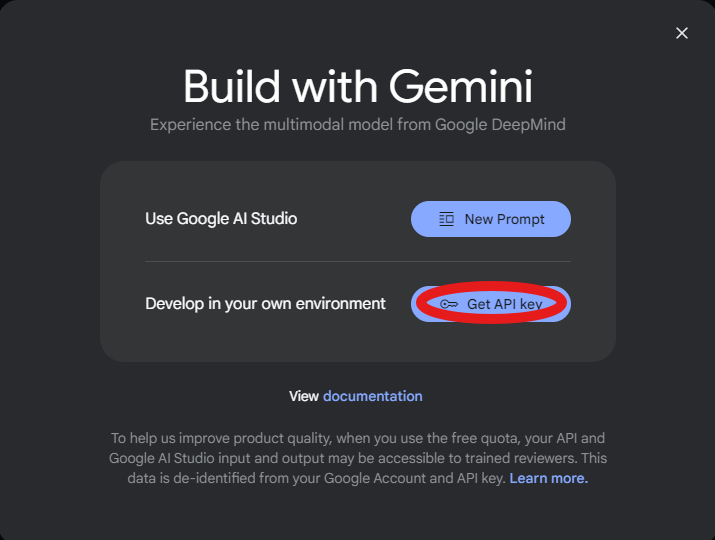
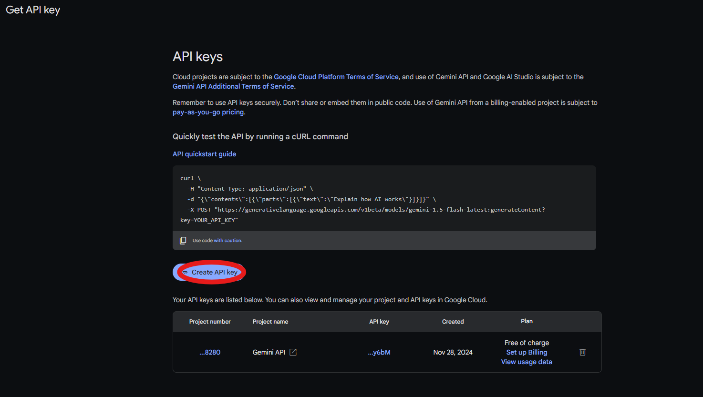
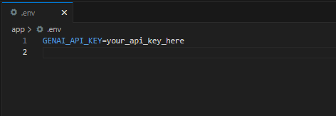
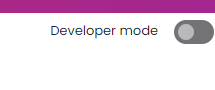
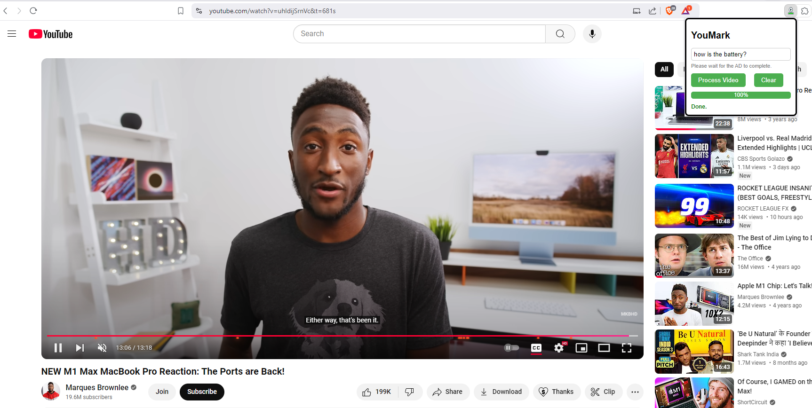

# YouMark


This Flask application provides a powerful interface for extracting and processing YouTube video transcripts. Utilizing advanced NLP techniques and integration with several APIs, including the YouTube Transcript API, spaCy, Google's generative AI models, and translation services, this API can detect the language of transcripts, translate them, and smartly identify relevant segments based on user queries.


## Features

- Fetch and process YouTube video transcripts.
- Language detection and automatic translation to handle non-English transcripts.
- Enhanced query processing with synonyms expansion and Gemini model integration for relevance checking.
- Advanced text analysis using spaCy for keyword extraction and text lemmatization.
- Easy integration with front-end applications through RESTful API endpoints to highlight relevant segments in the Youtube video.

## Installation

1. **Clone the Repository**

    ```bash
    git clone https://github.com/Asim4513/YouMark.git
    cd YouMark
    ```

2. **Set up a Virtual Environment (Optional but Recommended)**

    ```bash
    python -m venv venv
    source venv/bin/activate  # On Windows use `venv\Scripts\activate`
    ```

3. **Install Dependencies**

    ```bash
    cd app
    pip install -r requirements.txt
    ```

4. **Environment Variables**

    Replace the GenAI Key in the .env file in YouMark/app/.env with your GenAI API Key:

    ```plaintext
    GENAI_API_KEY=your_genai_api_key_here
    ```

5. **Run the Application**

    ```bash
    python application.py
    ```

## Usage

## Getting your Gemini AI API Key

1. **Visit the URL**

    ```bash
    https://aistudio.google.com/app/apikey
    ```

2. **Get an API Key once you login to your Google account**



Click on Create an API Key



Paste the API Key into the .env Folder : YouMark/app/.env




3. **Open the Chrome Browser and go to settings and Manage extensions and Turn on Developer Mode**




4. **Select Load Unpacked ad select the Folder YTExtension**


5. **Visit Youtube and go to your Favourite Video to Test the Extension out!**




### Key Take-Away
